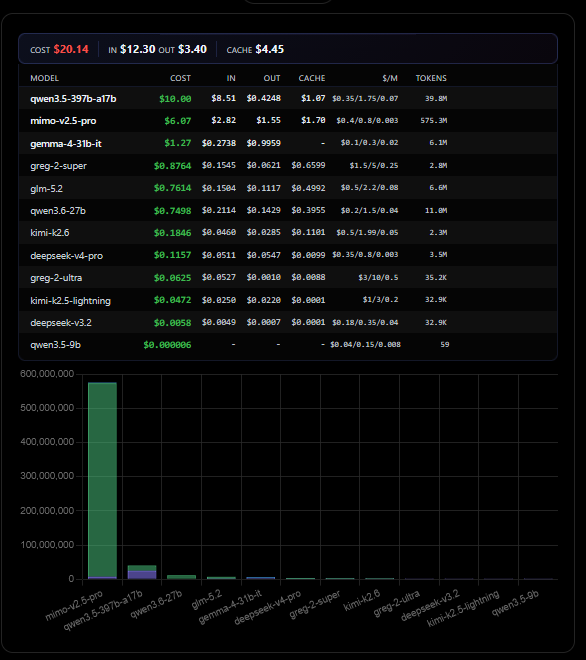

# crofai-userscripts

Tampermonkey user scripts to enhance the [Crof.ai](https://crof.ai) experience.

## Scripts

### Crof.ai Dashboard Cost Enrichment

**File:** `crofai-dashboard-pricing.user.js` (v1.7.0)

Shows per-model cost breakdown on the Crof.ai dashboard usage charts.



#### What it does

Adds a cost strip above the usage chart with:
- **Total cost** for the selected month/key
- **Per-model breakdown** — cost, input/output/cache costs, pricing rates ($/M tokens), and token counts
- Automatically updates when changing months (←/→) or switching API keys

#### How it works

1. Loads model pricing from `/v1/models` (cached 10 min)
2. Intercepts fetch/XHR API calls to `/user-api/usage` and `/monthly-usage-api/`
3. Calculates cost per model using token counts × pricing
4. Injects a styled cost strip above the chart

## Quick Install

[Click to install](https://raw.githubusercontent.com/geekbozu/crofai-userscripts/main/crofai-dashboard-pricing.user.js) (stable — `main` branch)

Or manually:

1. Install [Tampermonkey](https://www.tampermonkey.net/) for Firefox
2. Click the install link above
3. Tampermonkey will prompt you to install/update
4. Visit `https://crof.ai/dashboard`

Tampermonkey auto-checks for updates via `@downloadURL` / `@updateURL` — the stable `main` branch.

> **Pre-release / bleeding-edge builds** are on the `dev` branch:
> ```
> https://raw.githubusercontent.com/geekbozu/crofai-userscripts/dev/crofai-dashboard-pricing.user.js
> ```

## Development

```bash
git clone https://github.com/geekbozu/crofai-userscripts.git
cd crofai-userscripts
```

### Branch workflow

- **`main`** — stable, release-ready. Tampermonkey's `@downloadURL` points here.
- **`dev`** — active development. Test changes here first.

```bash
git checkout dev      # work on dev
# ... make changes, test in browser ...
git add -A
git commit -m "your message"
git push origin dev

# When stable, merge to main:
git checkout main
git merge dev
git push origin main
```

Edit `crofai-dashboard-pricing.user.js`, reload the dashboard to test.

## License

MIT
